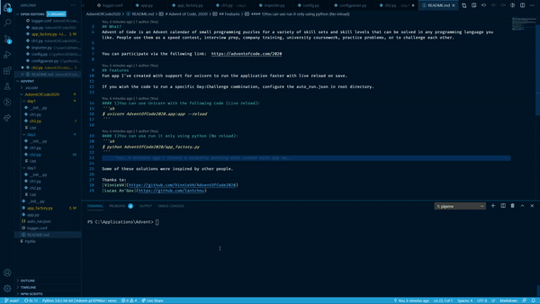

# Advent of Code, 2020!

## What?
Advent of Code is an Advent calendar of small programming puzzles for a variety of skill sets and skill levels that can be solved in any programming language you like. People use them as a speed contest, interview prep, company training, university coursework, practice problems, or to challenge each other.


You can participate via the following link:  https://adventofcode.com/2020

## Features
Fun app I've created with support for uvicorn to run the application faster with live reload on save.

If you wish the code to run a specific Day:Challenge combination, configure the auto_run.json in root directory.

#### 1)You can use Uvicorn with the following code (Live reload):
```sh
$ uvicorn AdventOfCode2020.app:app --reload
```

#### 1)You can use run it only using python (No reload):
```sh
$ python AdventOfCode2020/app_factory.py
```

## Demo
#### /advent.gif



Some of these solutions were inspired by other people.

Thanks to:
[VinnieVH](https://github.com/VinnieVH/AdventOfCode2020)
[Lucas An'Gov](https://github.com/lantchou)